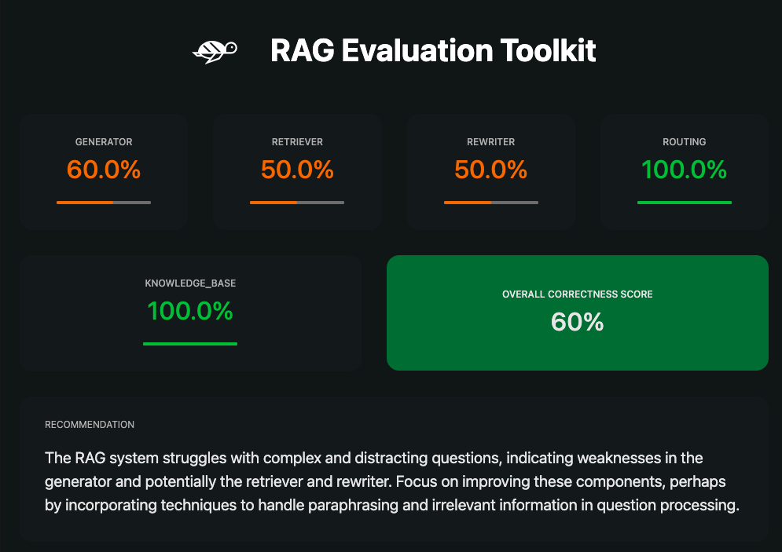
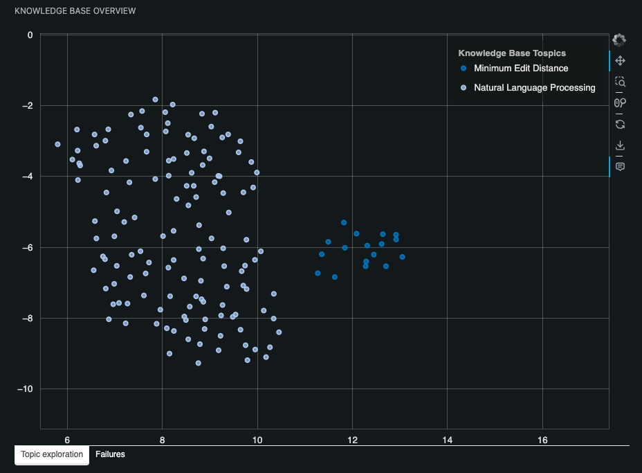
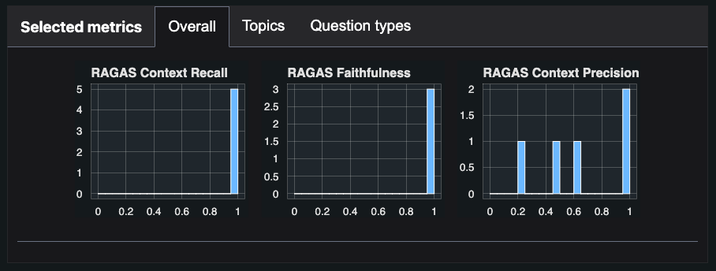
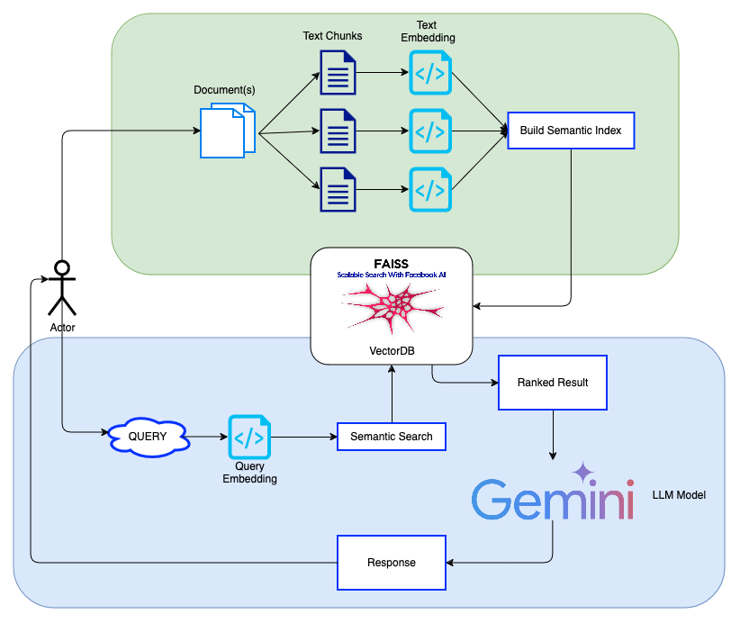
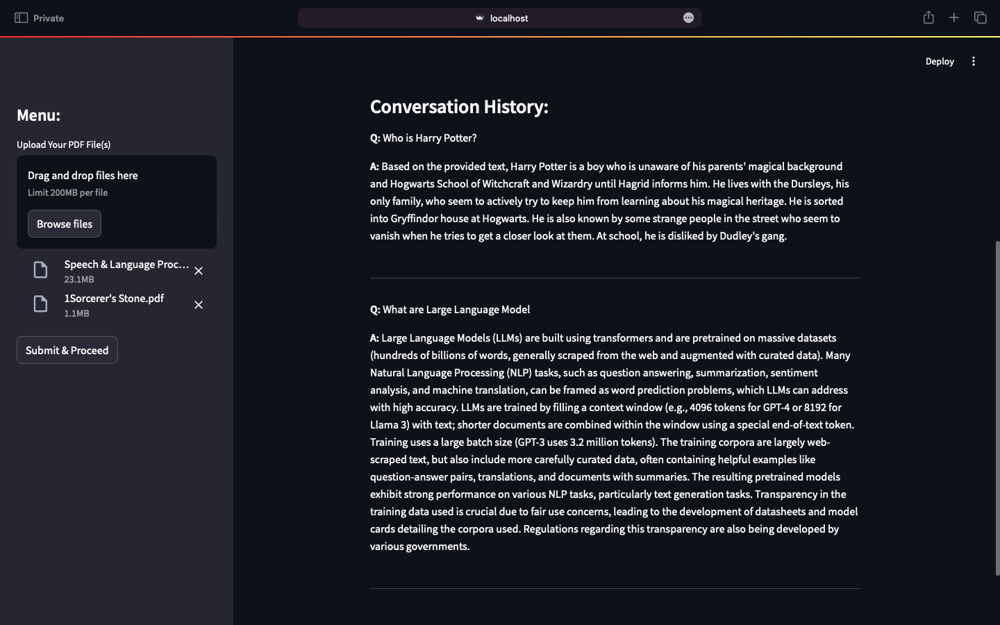

# DocuBOT
A chatbot to improve user experience by providing an efficient and intuitive way to access specific details or summaries within a collection of PDFs.


## Local Project Set Up

Follow these steps to set up the local environment for the project:

1. **Set Up Python Virtual Environment :** <br>
First, create a virtual environment for the project to manage dependencies:
``` bash
python -m venv myenv
```
This will create a directory named myenv that contains the virtual environment.
<br>
<br>

2. **Activate the Virtual Environment :** <br>
After creating the virtual environment, activate it.
On Windows:
``` bash
myenv\Scripts\activate
```

On macOS/Linux:
``` bash
source myenv/bin/activate
```
The terminal prompt should change to indicate that you are now working inside the virtual environment (e.g., (myenv)).
<br>
<br>

3. **Install Required Python Packages :** <br>
Upgrade pip to the latest version (if needed):
``` bash
python -m pip install --upgrade pip
```

Now, install the required dependencies from the requirements.txt file:
``` bash
pip install -r requirements.txt
```
This will install all the packages necessary to run the project.
<br>
<br>

4. **Set Up Google AI Studio API Key :** <br>
To integrate with Google AI Studio, you need to generate an API key:
```
• Go to [Google AI Studio](https://ai.google.dev/aistudio).
• Sign in to your Google account.
• Navigate to "Get API Key".
• Click the "Generate API Key" button.
• Copy the generated API key.
```
<br>
<br>

5. **Add the API Key to the .env File :** <br>
Edit the .env file in the root of the project directory and add the following line (replace <your-api-key> with your actual API key):
``` bash
GOOGLE_API_KEY = '<your-api-key>'
```
This allows the project to access the Google AI Studio API securely.
<br>
<br>

6. **Run The App :** <br>
To run the Streamlit app, use the following command:
``` bash
streamlit run app.py
```
After running the command, Streamlit will automatically open the app in your default web browser.

If the app does not open automatically, you can manually access it by entering the following URL in your browser:
```
http://localhost:8501
```
By default, Streamlit apps open on port 8501.
Have Fun
<br>
<br>

7. **Close the Streamlit App :** <br>
To stop the Streamlit app, you can either:
- Close the browser tab where the app is running.
    Note: This will stop the app from being displayed in your browser but does not stop the app itself from running in the terminal.

- Stop the app from the terminal by pressing 'Ctrl + C'.
This will terminate the Streamlit process and stop the app from running.
<br>
<br>

8. **Deactivate the Virtual Environment (Optional) :** <br>
When you're done working, you can deactivate the virtual environment by running:
``` bash
deactivate
```
<br>

## RAG Evaluation Metrics : 
- Knowledge Base: The set of documents given to the RAG to generate the answers.
- Generator: The LLM used inside the RAG to generate the answers.
- Retriever: Fetch relevant documents from the knowledge base according to a user query.
- Rewriter: Rewrite the user query to make it more relevant to the knowledge base or to account for chat history.
- Router: Filter the query of the user based on his intentions (intentions detection).
- Context Recall : Measures how many of the relevant documents (or pieces of information) were successfully retrieved. It focuses on not missing important results. Higher recall means fewer relevant documents were left out.
- Faithfulness : Measures the factual consistency of the generated answer against the given context. It is calculated from answer and retrieved context. The answer is scaled to (0,1) range. Higher the better.
- Context Precision : Measures the proportion of relevant chunks in the retrieved_contexts. It is calculated as the mean of the precision@k for each chunk in the context.








## Project Architecture


## Project Implementation Screenshots


